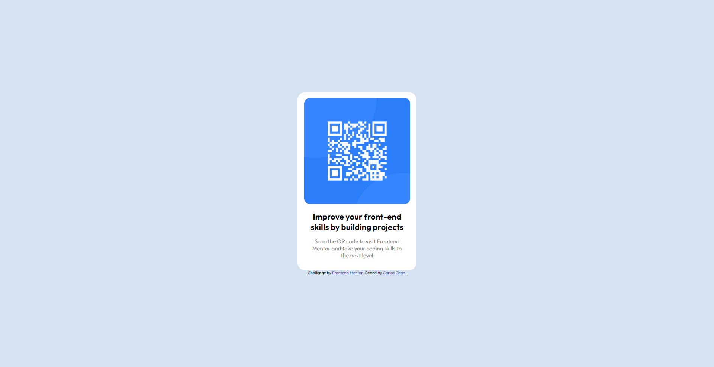

# Frontend Mentor - QR code component

## Welcome! 👋
Thanks for checking out this front-end coding challenge.

[Frontend Mentor](https://www.frontendmentor.io) challenges help me improve my coding skills by building realistic projects.

## The challenge
The challenge is to build out this QR code component and get it looking as close to the design as possible.

I can use any tools I like to help me complete the challenge.

# Frontend Mentor - QR code component solution
This is a solution to the [QR code component challenge on Frontend Mentor](https://www.frontendmentor.io/challenges/qr-code-component-iux_sIO_H)

## Table of contents
- [Overview](#overview)
  - [Screenshot](#screenshot)
  - [Links](#links)
- [My process](#my-process)
  - [Built with](#built-with)
  - [What I learned](#what-i-learned)
  - [Continued development](#continued-development)
  - [Useful resources](#useful-resources)
- [Author](#author)
- [Acknowledgments](#acknowledgments)

## Overview

### Screenshot

My desktop solution 

 

My mobile solution 

### Links
- Solution URL: [GitHub](https://github.com/Cechr/frontendmentor-challenges/tree/main/qr-code-component)
- Live Site URL: [Netlify](https://my-qr-code-component.netlify.app/)

## My process

### Built with

- Semantic HTML5 markup
- CSS custom properties
- Flexbox

### What I learned
I learned how to use Flexbox and use some CSS properties.

### Continued development
I want to continue focusing on the use of CSS, Flexbox and CSS Grid to create nice and cool web pages with UX/UI rules and good practices.

### Useful resources
- [w3schools - CSS Reference](https://www.w3schools.com/cssref/default.asp) - This helped me for remembering CSS properties and how to use properly. I really liked this page.
- [css-tricks / A Complete Guide to Flexbox](https://css-tricks.com/snippets/css/a-guide-to-flexbox/) - This is an amazing cheatsheet. I'd recommend it to anyone still learning this concept.
- [Flexbox cheatsheet](https://flexbox.malven.co/) - This is an amazing cheatsheet which helped me finally understand Flexbox. I'd recommend it to anyone still learning this concept.

## Author
- Frontend Mentor - [@Cechr](https://www.frontendmentor.io/profile/Cechr)
